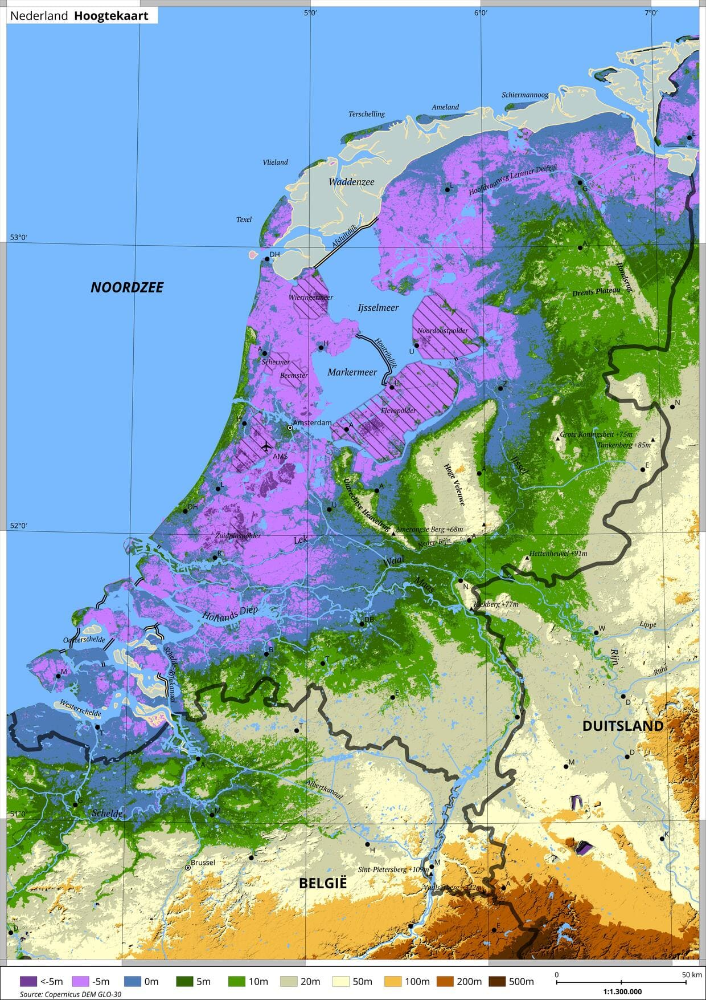

# maps


[](https://uptime.betterstack.com/?utm_source=status_badge)

- [https://maps.oskar-westmeijer.com](https://maps.oskar-westmeijer.com)

I create thematic maps with the tool QGIS. Most of the data used for creating the map, is free and provided by the Copernicus project.

## Technologies

```
- Svelte & Vite
- Tailwind & DaisyUi
- Nginx
```

## Local development

```bash
npm install
npm run dev
```

## Example map

Check out the website for more maps.

