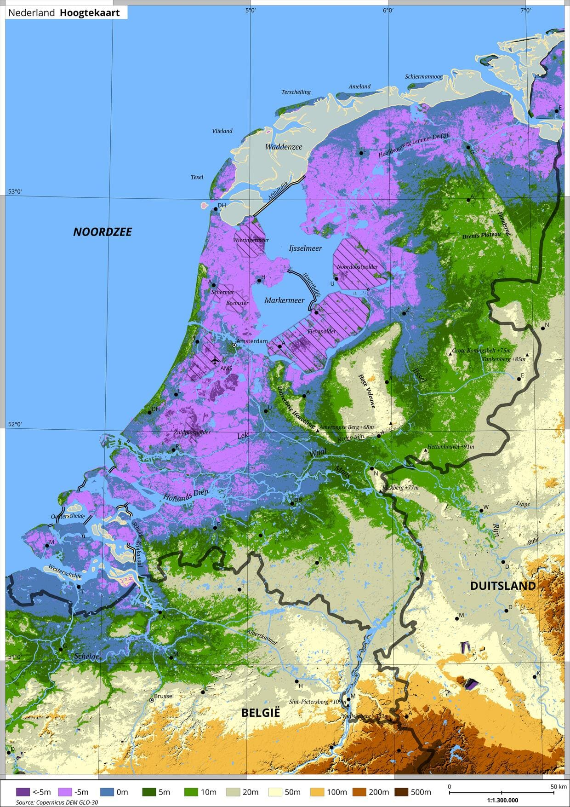

# maps


[](https://uptime.betterstack.com/?utm_source=status_badge)

I create thematic maps with the tool QGIS. Most of the data used for creating the map, is free and provided by the Copernicus project.

- [https://maps.oskar-westmeijer.com](https://maps.oskar-westmeijer.com)

## Technologies

```
- Sveltekit (SSG) & Vite
- Vitest & Playwright
- Tailwind & DaisyUi
- Nginx
```

## Example map

Check out the website for more maps.



## Build & test

### Vitest Unit test
```bash
npm install
npm run build
```

### Playwright e2e test

I develop on Linux Fedora, which does not natively support playwright. Use distrobox. 


#### Prerequisites
```bash
sudo dnf install distrobox
mkdir ~/distrobox
distrobox create \
--name ubuntu --image ubuntu:24.04 \
--home ~/distrobox/ubuntu \
--additional-packages "git vim nodejs npm"
```

#### Test execution
```bash
distrobox enter ubuntu
npx playwright install --with-deps
npm run test:e2e
distrobox stop ubuntu
```

## Local development

```bash
npm install
npm run dev
```

## Update dependencies

Use ncu to update the dependencies. `npm install -g npm-check-updates`

```bash
# list possible updates
ncu

# granular updates
ncu -u --target=patch
ncu -u --target=minor

# run major updates
ncu -u
npm install
```