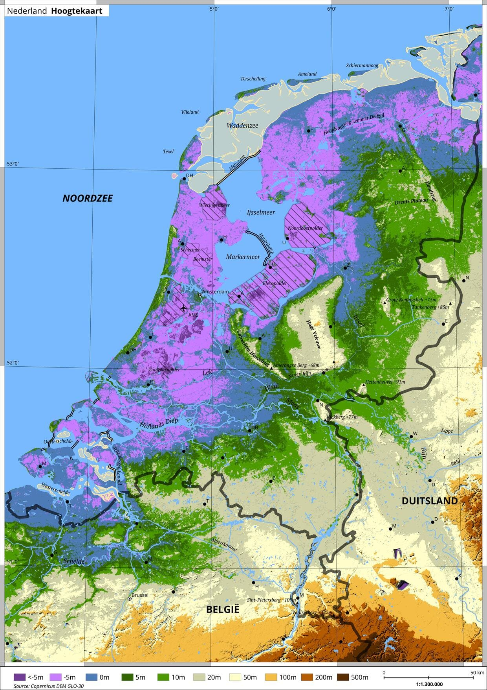

# maps


[](https://uptime.betterstack.com/?utm_source=status_badge)

I create thematic maps with the tool QGIS. Most of the data used for creating the map, is free and provided by the Copernicus project.

- [https://maps.oskar-westmeijer.com](https://maps.oskar-westmeijer.com)

## Technologies

```
- Sveltekit (SSG) & Vite
- Vitest & Playwright
- Tailwind & DaisyUi
- Nginx
```

## Example map

Check out the website for more maps.



## Build & test

### Vitest Unit test
```bash
npm install
npm run build
```

### Playwright e2e test

I develop on Linux Fedora, which does not natively support playwright. Use distrobox. 


#### Prerequisites
```bash
sudo dnf install distrobox
mkdir ~/distrobox
distrobox create \
--name ubuntu --image ubuntu:24.04 \
--home ~/distrobox/ubuntu \
--additional-packages "git vim nodejs npm"
```

#### Test execution
```bash
distrobox enter ubuntu
npx playwright install --with-deps
npm run test:e2e
distrobox stop ubuntu
```

## Local development

```bash
npm install
npm run dev
```

## Update the map data

The interactive maps read their figures from Statistics Finland's PxWeb API. Fetch the latest
release with (Python 3, standard library only — no venv, no pip):

```bash
# see what would change, without writing anything
python3 scripts/fetch_statfi.py --dry-run --verbose

# refresh the committed copy in static/data
python3 scripts/fetch_statfi.py
```

Each table reports what happened to its file — `written`, or `left alone` when the API returned
figures byte-identical to the local copy, which is the usual result since the tables are monthly
and annual. `manifest.json` is the exception: it records the poll time, so it is rewritten on
every successful run. `manifest.json` is not committed — its timestamp would churn on every run — so after a fresh
clone the maps omit the "polled" date until you run the script once. The manifest is served at
[`/data/manifest.json`](https://maps.oskar-westmeijer.com/data/manifest.json), so you can check
from the browser what production is serving. It carries three dates per file: `period` (what the
figures describe), `updated` (when Statistics Finland published them) and `polled` (when the cron
last asked). A stale `updated` next to a fresh `polled` means the pipeline is healthy and there is
simply nothing new to fetch.

The script validates every response before writing, and leaves the previous files untouched if
anything is missing or malformed. In production the same script runs daily over SSH
(`.github/workflows/refresh-data.yml`) and writes to a directory nginx serves — the maps fetch
these files at page load, so new figures go live without a rebuild or a redeploy.

## Update dependencies

Use ncu to update the dependencies. `npm install -g npm-check-updates`

```bash
# list possible updates
ncu

# granular updates
ncu -u --target=patch
ncu -u --target=minor

# run major updates
ncu -u
npm install
```